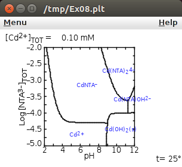

#    Chemical Equilibrium Diagrams (Java)

**Spana** is a program that allows the user to create and view chemical equilibrium diagrams for aqueous systems. The chemical system is defined by the user through the **Database** program, which may be called from **Spana**.

A previous software version for Windows (Visual Basic) named (**Medusa/Hydra**) and developped at [KTH][1] is available at https://sites.google.com/site/chemdiagr

 [1]: https://www.kth.se/che/medusa/

## Download
All downloads are available in the [releases section][2]. There are thee variants of Chemical Equilibrium Diagrams: multi platform, Windows or MacOS, each version is either a complete zip file or a Windows installer.

- The multi-platform zip-file contains jar-files which may be used under Ubuntu (Linux), Windows or MacOS.

- The Windows setup program contains Windows "exe" files (Java launchers). No administrator rights are needed to install the software. Install either on a computer or as portable software on a USB memory stick.

- The MacOS zip-file contains Mac application bundles.

 [2]: https://github.com/ignasi-p/eq-diagr/releases/latest

## Features
* Completely portable - runs off a USB or hard drive.
* Does not require administrator privileges.
* Diagrams may be copied and pasted, printed or exported to image files in formats such as PostScript, PDF, JPG, PNG, etc.
* Example chemical equilibrium diagrams that may be produced with this software:

  

## Get going

[Make your 1st diagram with SPANA and DATABASE][3] (PDF-file).

 [3]: https://github.com/ignasi-p/eq-diagr/Make_1st_diagram.pdf

## System Requirements

* Java 1.7 or later.
* Apple computers: Java 7 requires an Intel-based Mac running Mac OS X 10.7.3 (Lion) or later with a 64-bit browser (Safari, for example).
* [PortableApps.com platform][4] (optional in Windows systems).

 [4]: http://portableapps.com

## License

* This software is released under [GPLv3 license][5].

 [5]: https://sv.wikipedia.org/wiki/GNU_General_Public_License

## Report problems

## Credits

The motor behind **Spana**, performing the chemical equilibrium calculations, is **HALTAFALL** published in:

- Ingri N, Kakolowicz W, Sillén L G, Warnqvist B, 1967. High-speed computers as a supplement to graphical methods - V. HALTAFALL, a general program for calculating the composition of equilibrium mixtures. [Talanta, 14: 1261-1286][10]. _Errata:_ [Talanta, 15(3) (1968) xi-xii][11].

- Warnqvist, B., Ingri, N., 1971. The HALTAFALL program - some corrections, and comments on recent experience. [Talanta 18, 457–458][12].

Many ideas for the plotting of chemical diagrams are from the **SOLGASWATER** code by [Gunnar Eriksson][13], at Umeå uiversity by that time. SOLGASWATER's publication:

* Eriksson G, 1979. An algorithm for the computation of aqueous multicomponent, multiphase equilibria. [Anal. Chim. Acta, 112: 375-383][14].

 [10]: https://doi.org/10.1016/0039-9140(67)80203-0
 [11]: https://doi.org/10.1016/0039-9140(68)80071-2
 [12]: https://doi.org/10.1016/0039-9140(71)80069-3
 [13]: https://www.hanser-elibrary.com/doi/pdf/10.3139/146.070904
 [14]: https://doi.org/10.1016/S0003-2670(01)85035-2

**DataBase** (formerly HYDRA) is inspired on a
program & database (initially for MS-DOS) created by Mingsheng Wang, Andrey Zagorodny under the leadership of Mamoun Muhammed at Materials Chemistry, Royal Institute of Technology (KTH), Stockholm.

Several code parts and programming suggestions are from Réal Gagnon's site [Real's HowTo][20]. The external browser launcher is [BareBones][21]. The Java "vector cut-and-paste" class [jvectClipboard][22] is by Serge Rosmorduc, see [JSesh][23]. ClassLocator, ClipboardCopy, CSVparser,  ExternalLinkContentViewerUI, PrintUtility and SortedListModel are adapted from ideas and code found in the internet at diverse sites (many not found anymore). This software has been developped using the [portable][24] version of [Netbeans][25].

[20]: http://www.rgagnon.com/howto.html
[21]: http://centerkey.com/java/browser
[22]: http://comp.qenherkhopeshef.org/jvectCutAndPaste
[23]: https://sourceforge.net/projects/jsesh/
[24]: https://github.com/garethflowers/netbeans-portable
[25]: https://netbeans.org/

The following persons have contributed with ideas and suggestions: Johan Blixt (KTH), Gunnar Eriksson (Umeå),
Ingmar Grenthe (KTH), Sven-Olof Pettersson (Studsvik) and
Joachim Zeising (KTH). Many thanks are due to the chemistry teaching staff at KTH: Joan Lind, Gabor Merenyi, Olle Wahlberg, Tom Wallin, Mats Jansson, Märtha Åberg, and many others. And many thanks to all students who helped me in shaping up the software and in finding many bugs!
